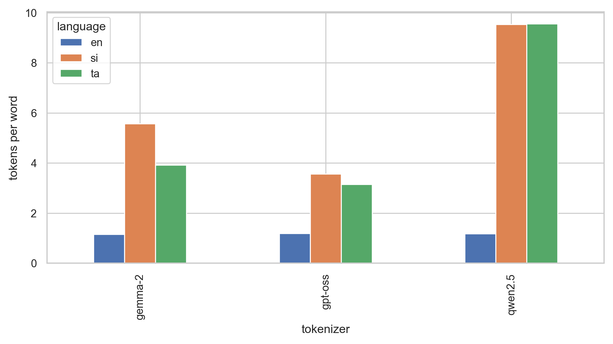
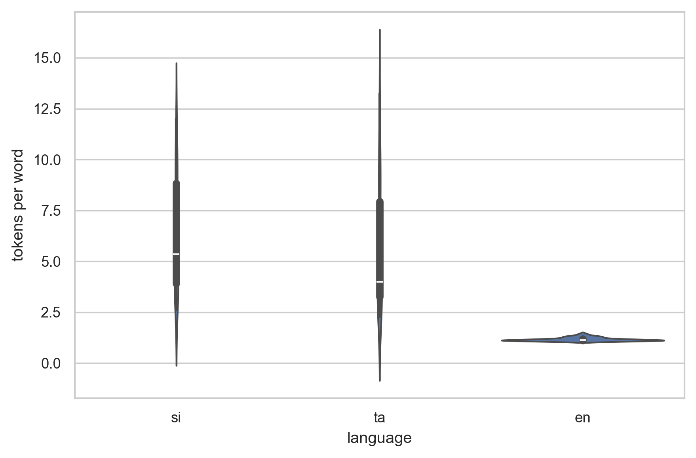

# Does a multilingual LLM pivot through English when prompted in Sinhala?

[](LICENSE)
[](requirements.txt)
[](tests/)
[](https://huggingface.co/google/gemma-2-2b)

An interpretability study asking whether `google/gemma-2-2b`'s internal
residual stream passes through an English-like representation when
processing **Sinhala** prompts — in the spirit of Wendler et al. (2024),
*[Do Llamas Work in English? On the Latent Language of Multilingual
Transformers](https://arxiv.org/abs/2402.10588)*. Sinhala is low-resource,
Brahmic-script, and heavily under-tokenized — a condition no prior
latent-language study has covered.

> **TL;DR (preliminary, n=14 of 100 probes):** zero traced prompts show a
> stable pivot to Sinhala under this repo's strict definition. Most stay
> English-like (`latin`-script readout) end to end; a minority start
> Sinhala-like and degrade into unclassified tokens. Read this as an early
> signal, not a finding — see [Headline result](#headline-result-preliminary)
> below for the honest caveats.

---

## Contents

- [Research question](#research-question)
- [Method, at a glance](#method-at-a-glance)
- [Tokenizer fertility](#tokenizer-fertility-control-not-a-finding)
- [Headline result](#headline-result-preliminary)
- [Repo layout](#repo-layout)
- [Running it](#running-it)
- [Status / what's left](#status--whats-left)
- [Citation](#citation)

---

## Research question

Wendler et al. (2024) showed that decoding the residual stream of
Llama-family models at middle layers, via the logit lens, produces
English-like tokens even when the prompt and target output are French,
German or Chinese — evidence that the model's internal concept space is
biased toward English, with target-language identity applied late. Every
language tested so far is high-resource and mostly Latin-script.

This project asks the same question of Sinhala:

| Outcome | What it would mean |
|---|---|
| **Same pivot, weaker/later** | The mechanism generalizes, just less confidently |
| **No coherent pivot** | The representation stays diffuse — would directly predict the reliability problems Sinhala-facing systems actually exhibit |
| **Pivot through a third language** | e.g. Hindi, via script/lexical adjacency — nobody has looked for this |

All three outcomes are treated as publishable. Logit-lens results are
**correlational only** — they show what the output head *would* produce
from an intermediate layer, not that the model is "thinking" in a language.
The only causal claims in this repo rest on activation patching.

## Method, at a glance

| Step | Question it answers | Claim type | Module |
|---|---|---|---|
| Tokenizer fertility | Is Sinhala mechanically more fragmented? | Confound control | [`src/fertility.py`](src/fertility.py) |
| Logit lens | What would the output head say at layer *N*? | Correlational | [`src/logit_lens.py`](src/logit_lens.py) |
| Linear probes | Is language linearly decodable from `resid_post`? | Correlational (narrower) | [`src/probes.py`](src/probes.py) |
| Activation patching | Does transplanting layer *N* flip the output? | **Causal** | [`src/patching.py`](src/patching.py) |

Every method above is backed by controls (identity, shuffled-prompt,
shuffled-label, placebo patching, cross-model replication) — see
[`docs/CONTROLS.md`](docs/CONTROLS.md).

## Tokenizer fertility (control, not a finding)

Mean tokens per word, per tokenizer and language, on the parallel corpora in
[`data/`](data/):

| tokenizer | en | si | ta |
|---|---|---|---|
| gemma-2 | 1.15 | **5.57** | 3.92 |
| gpt-oss (o200k_harmony) | 1.18 | **3.56** | 3.15 |
| qwen2.5 | 1.17 | **9.53** | 9.55 |

Sinhala costs **3.6×–9.5×** as many tokens per word as English, depending on
the tokenizer. `meta-llama/Llama-3.2-1B` could not be measured (gated,
access not granted — see [`results/fertility_llama-3.2_STATUS.md`](results/fertility_llama-3.2_STATUS.md)).

<p align="center">
  
  
</p>

> **This is a confound, not a finding.** Higher fertility means more
> sequence positions to process the same content — more room, mechanically,
> for a pivot to happen or not. Any pivot-depth difference reported below
> must be read against this number.

## Headline result (preliminary)

14 of 100 probe prompts have a completed logit-lens trace in this repo's
verified CPU execution environment ([`docs/COMPUTE.md`](docs/COMPUTE.md); each
trace takes ~3-4 minutes with no GPU). On those 14:

- **`pivot_rate = 0.0`** — zero prompts showed a *stable* switch to
  Sinhala-script readout (`src.pivot.detect_pivot`)
- Most prompts stay `latin`-script readouts nearly end to end
- A minority start `sinhala`-script in early layers, then degrade into
  unclassified tokens rather than settling on any script
- **No** prompt showed the classic Wendler-et-al.
  pivot-through-English-then-back-to-source-language pattern

This is **not a dataset-level claim** — n=14 is far too small, and no
controls or activation patching have run against these traces yet. It is
reported here because the honesty rule governing this repo requires
reporting what was actually run, not projecting what a full run would
likely show. Full details and caveats: [`paper/draft.md`](paper/draft.md).

## Repo layout

```
src/           experiment logic — see the module-level docstring in each
                 file for what it does and does not claim
scripts/       CLI entrypoints (fertility, traces, probes, patching)
notebooks/     01 fertility · 02 logit lens · 03 probes · 04 patching
app/           Gradio demo — tokenization strip, layer stack, pivot callout
data/          parallel probe set + fertility corpora (unverified, see below)
results/       parquet/jsonl results + manifest.json (provenance per artifact)
figures/       exported plots
paper/         draft writeup
```

## Running it

```bash
pip install -r requirements.txt
export HF_TOKEN=...          # accept the Gemma-2 license first: hf.co/google/gemma-2-2b

python -m app.app            # interactive demo at http://127.0.0.1:7860
python scripts/run_traces.py --limit 10   # batch logit-lens traces
python -m pytest             # 55 tests
```

See [`docs/DEPLOYMENT.md`](docs/DEPLOYMENT.md) for HuggingFace Spaces setup.

## Status / what's left

| Item | Status |
|---|---|
| Repo scaffolding, all `src`/`scripts`/`app`/`notebooks`/`tests` | done |
| Tokenizer fertility (3 of 4 tokenizers) | done, real data |
| Logit-lens traces | 14 / 100 probes (running in background as compute allows) |
| Probe set native-speaker verification | **not started** — every row is `verified=false` by design; gates the "real" experiment runs |
| Linear probes / activation patching | coded, not yet run at scale |
| Llama-3.2 fertility | blocked — gated repo, access not granted |
| `drip.yml` release schedule | live — promotes `dev` → `main` automatically, see `results/manifest.json` for provenance |

## Citation

```bibtex
@article{wendler2024llamas,
  title={Do Llamas Work in English? On the Latent Language of Multilingual Transformers},
  author={Wendler, Chris and Veselovsky, Veniamin and Monea, Giovanni and West, Robert},
  journal={arXiv preprint arXiv:2402.10588},
  year={2024}
}
```

---

<sub>MIT licensed (code only — see [`LICENSE`](LICENSE); model weights carry
their own separate licenses).</sub>
